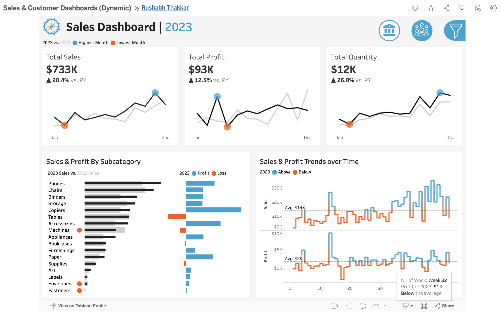

# 📊 Dynamic Sales & Customer Dashboard (Tableau)

## 🔍 Overview
This Tableau project presents a **unified, interactive dashboard** combining both **Sales** and **Customer Analytics**. It enables stakeholders to explore trends and performance across multiple years, products, and locations using built-in filter controls.

## 🌐 Live Dashboard

🔗 [**View the Interactive Dashboard on Tableau Public**](https://public.tableau.com/app/profile/rushabh.thakkar4310/viz/SalesCustomerDashboardsDynamic_17477185462510/CustomerDashboard)

> Explore the fully interactive version of this dashboard with filters for year, product category, sub-category, and geographic region (Region, State, City).

## 🎯 Dashboard Purpose
The purpose of this dashboard is to present an overview of key **sales metrics** and **customer behavior** in order to analyze year-over-year performance, monitor trends, and uncover insights that support data-driven decisions.

---

## 📌 Key Requirements

### 📊 KPI Overview
- Display a summary of total **Sales**, **Profit**, and **Quantity** for the current and previous year.

### 📈 Sales Trends
- Present monthly performance for each KPI.
- Highlight the highest and lowest performing months for quick pattern recognition.

### 🧩 Product Subcategory Comparison
- Compare performance across product subcategories for current and previous years.
- Show both sales and profit figures for better business evaluation.

### 📅 Weekly Trends for Sales & Profit
- Present weekly-level insights for current-year data.
- Display average weekly values.
- Highlight weeks above and below average to flag spikes or slumps.

---

## 🧠 What This Dashboard Shows

### 🧑‍🤝‍🧑 Customer Insights
- 📈 **Total Customers** with YoY comparisons
- 💸 **Sales per Customer** to track value generation
- 📦 **Total Orders** volume across time
- 🧱 **Customer Order Distribution** to understand purchasing behavior
- 🏆 **Top 10 Customers by Profit**, including recent order activity

### 🛍️ Sales Insights
- 💵 **Total Sales** & **Profit** with YoY trends
- 📊 **Quantity Sold** across categories
- 📉 **Profit vs Loss by Subcategory**
- 📆 **Weekly Sales & Profit Trends**

---

## 🎛️ Dynamic Filters
The dashboard supports real-time filtering based on:

- 📅 **Year**: 2020, 2021, 2022, 2023
- 📦 **Product**:
  - Category (e.g., Phones, Chairs, Tables)
  - Sub-Category (e.g., Binders, Copiers, Accessories)
- 📍 **Location**:
  - Region
  - State
  - City

These filters help users tailor the view for specific product lines, regions, and time periods.

---

## 🎯 Purpose
This project demonstrates how interactive dashboards can:
- Track business performance over multiple years
- Identify high-performing products and customers
- Pinpoint areas with losses or growth potential
- Empower data-driven decisions across departments

---

## 🛠️ Tools Used
- **Tableau**: Interactive dashboard design and data visualization
- **CSV/Excel**: Source data (synthetic for demonstration)

---

## 👤 Author

**Rushabh Thakkar**  
🔗 [LinkedIn](https://www.linkedin.com/in/rushabhthakkar) | [GitHub](https://github.com/rushabh1605)
